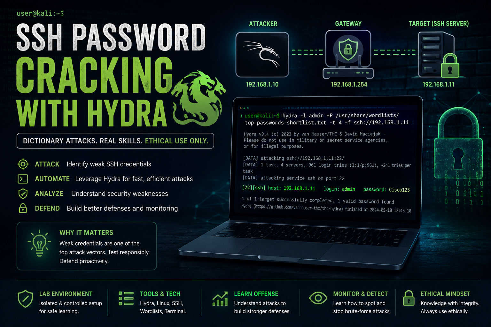
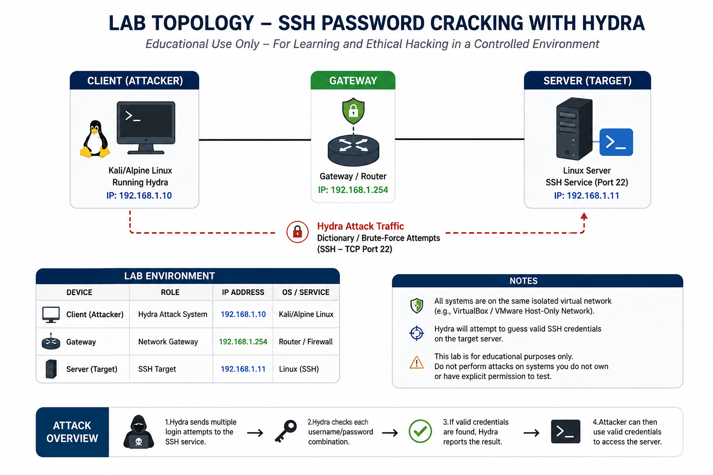
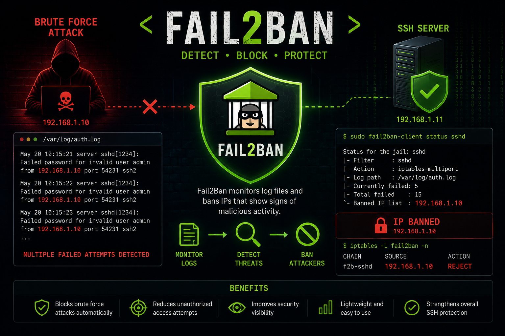

## Disclaimer

This project was performed in a controlled lab environment for educational and defensive security purposes only. Unauthorized password attacks against systems you do not own or have permission to test are illegal.

Hydra supports both brute-force and dictionary attacks.

- Brute-force attacks attempt every possible password combination.
- Dictionary attacks use predefined password lists to test common credentials more efficiently.

This lab demonstrates a dictionary attack against SSH authentication.

SSH is commonly targeted because it provides remote administrative access to Linux systems. Weak passwords or reused credentials can allow attackers to gain unauthorized access.



## Defensive Considerations

Hydra attacks can often be detected through:

- Multiple failed authentication attempts
- SSH authentication logs
- IDS/IPS alerts
- SIEM correlation rules

Mitigation strategies include:

- Strong password policies
- Multi-factor authentication (MFA)
- Fail2Ban
- Account lockout policies
- Disabling password authentication for SSH
- Using SSH keys instead of passwords

## Lab Environment

| Device | IP Address | Purpose |
|--------|------------|---------|
| Gateway | 192.168.1.254 | Network Gateway |
| Client | 192.168.1.10 | Hydra Attack System |
| Server | 192.168.1.11 | Target SSH Server |



## Hydra Command Syntax

hydra -l admin -P /usr/share/wordlists/top-passwords-shortlist.txt -t 4 -f ssh://192.168.1.11

* -l admin: We’re focusing on a single user: “admin.”
* -P /usr/share/wordlists/top-passwords-shortlist.txt: Using a small dictionary to test some common passwords.
* -t 4: Making up to four attempts in parallel.
* -f: Stop running Hydra after the first match.
* ssh://192.168.1.11: Tells Hydra to target SSH on IP 192.168.1.11 (port 22 by default).

If valid credentials are discovered, Hydra reports the successful login pair and terminates the attack when `-f` is enabled.

* [22][ssh] host: 192.168.1.11 login: admin password: Cisco123

## Security Impact

Weak SSH credentials can allow attackers to:

- Gain remote system access
- Escalate privileges
- Move laterally across networks
- Deploy malware or ransomware
- Exfiltrate sensitive data

## Fail2Ban Protection

To help defend against SSH brute-force attacks, Fail2Ban can automatically detect repeated failed login attempts and temporarily ban the attacking IP address.



### Install Fail2Ban

```bash
sudo apt-get install fail2ban

sudo systemctl enable fail2ban #enable ssh protection
sudo systemctl start fail2ban

sudo fail2ban-client status sshd #check ssh jail status

#example output:

Status for the jail: sshd
|- Currently failed: 5
|- Total failed: 15
`- Banned IP list: 192.168.1.10
```
### Security Benefit

Fail2Ban helps mitigate Hydra-style attacks by:
* Monitoring failed SSH login attempts
* Automatically banning malicious IP addresses
* Reducing brute-force attack effectiveness
* Improving SSH security visibility and monitoring

## Summary

This project demonstrates a controlled SSH password attack lab using Hydra against an SSH service in a Linux environment. The lab showcases how weak credentials can be exploited through dictionary-based attacks and highlights the importance of defensive security controls such as strong password policies, SSH hardening, authentication monitoring, and Fail2Ban protection.

The project also reinforces foundational cybersecurity concepts including Linux administration, network services, authentication security, offensive tooling, and defensive mitigation strategies within a safe and authorized lab environment.
